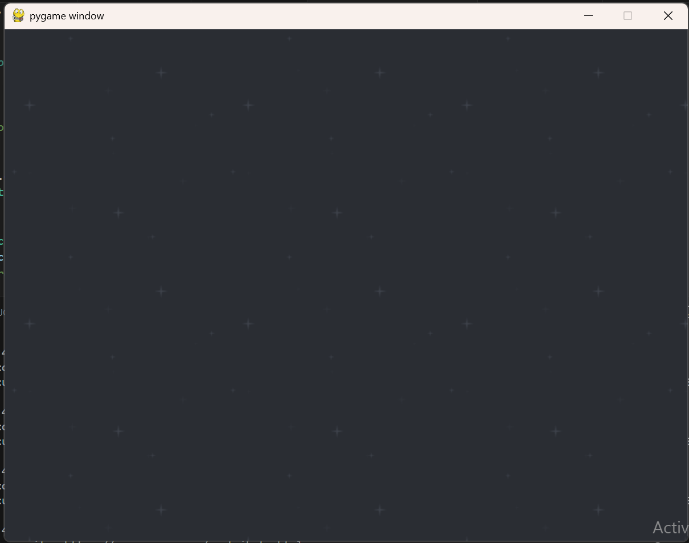
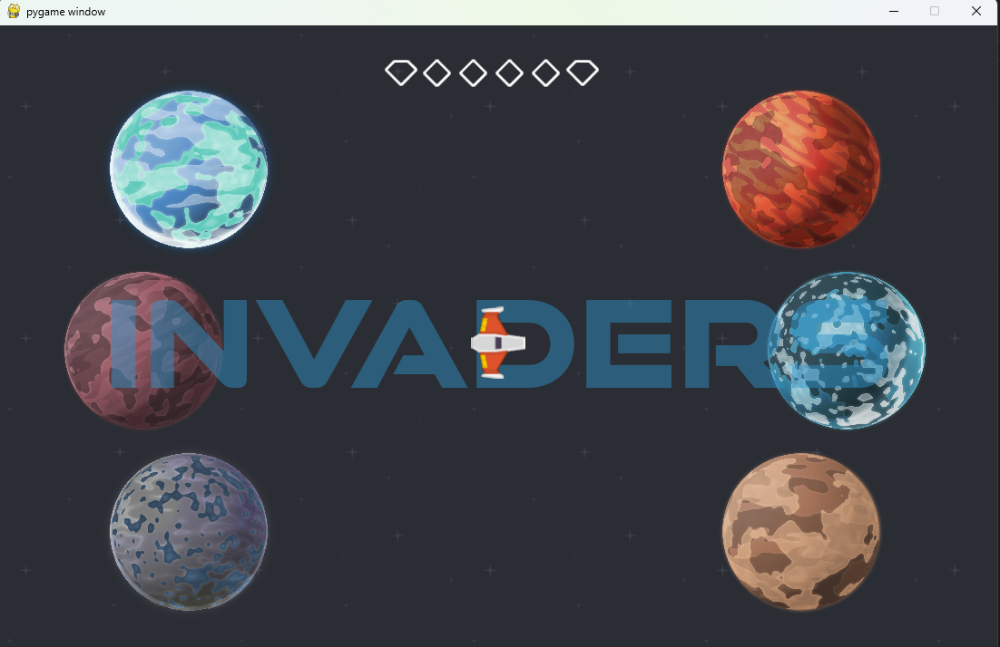
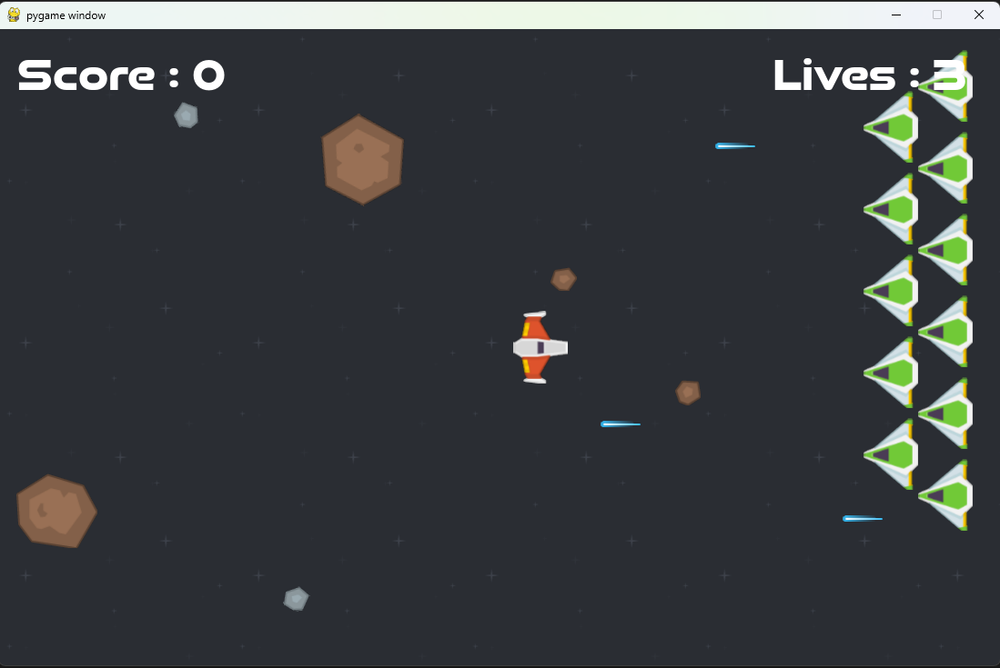

## SpaceShip Game

### Background

[Docsify Documentation Page](https://github.com/natashastramrood/game)

### Title Screen

### Screenshot of current game:

## Directions:
1. Play against the enemy space ships and defeat them without losing all three of your lives.
2. Kill the enemies with lasers in the ground level and obtain the colored relics.
3. Repeat for all the planets until you have invaded and gained the relics from them all!!

